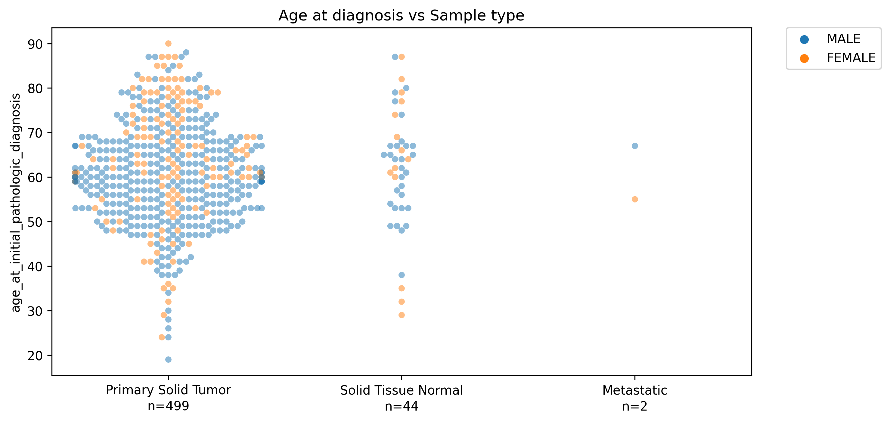
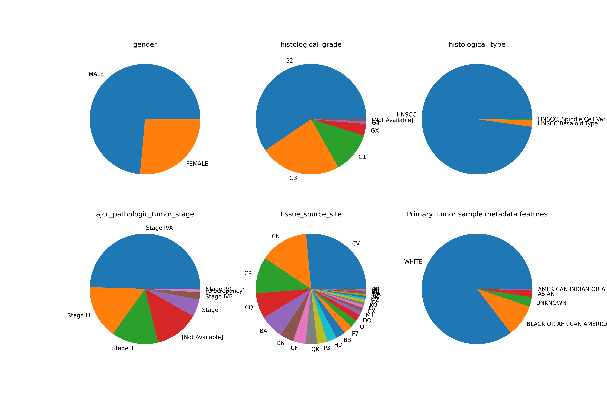

# BENG 285/BNFO 285/ECE 204. Statistical Learning in Bioinformatics: Project 1

## Setup

Clone this repo, create a virtual python environment, and install the required python libraries

```bash
git clone https://github.com/mikecuoco/ece204_project1.git
cd ece204_project1
python -m venv .venv # must be python 3.9
source .venv/bin/activate
pip install -r requirements.txt
```

If you need additional python libraries for the project, add them to this file

## Download the data

To download the data (143 Mb) from Dropbox, run the following command

```bash
bash download_data.sh
```

This will create the following data to the `data` directory.

```bash
data/
├── TCGA.HNSC.expression.txt
├── TCGA.HNSC.metadata.txt
└── TCGA.HNSC.mutations.txt
```

## Cohort summary

See `cohort_summary.ipynb` for a summary of the cohort.

We have 545 samples from 500 individuals. All but one individual have a primary tumor sample.



Individuals with primary tumors are distributed as follows




## Load, normalize, and embed the data

Run the following command to load, normalize, and embed the data

```bash
python embed.py
```

This script does the following

1. Combines the metadata and expression data into a single [`Anndata`](https://anndata.readthedocs.io/en/latest/index.html) object. 
2. Parses the sample codes to add `tissue_source_size` and `sample_type` to the metadata
3. Parses the `histological_grade` column to make numerical
4. Removes unexpressed genes 
5. `log(x+1)` normalizes and standarizes the expression data
6. Embed the data using a full PCA and MDS.
7. Use jackstraw permutation test to estimate the number of useful principal components for UMAP and t-SNE
8. Embed the data using UMAP and t-SNE on the jackstraw-determined PCs
9. Embed the data using PCA, MDS, UMAP, and t-SNE by varying the `n_components` parameter 1-10
10. Save the data to `data/TCGA.HNSC.embedded.h5ad`

## Analyze

Create your own jupyter notebook and select the python installation in `.venv` as the kernel to analyze the data

To read in the embedded data, use the following code.

```python
from anndata import read_h5ad
adata = read_h5ad('data/TCGA.HNSC.embedded.h5ad')
adata.X # log-normalized and standardized expression matrix
adata.obs # see metadata
adata.obsm['pca'] # PCA
adata.obsm['mds'] # MDS
adata.obsm['umap'] # UMAP
adata.obsm['tsne'] # t-SNE
```

